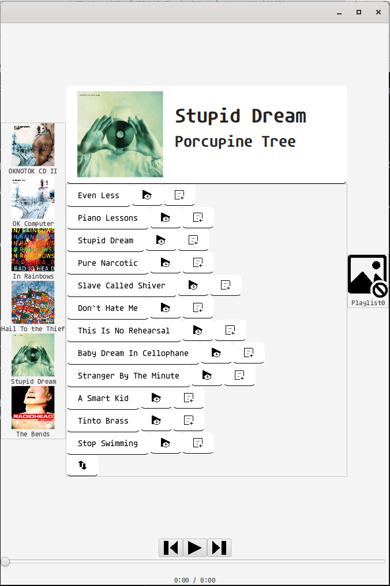

# OpenAudio
## FOSS Music Player
A music player for local audio files, with support for albums, playlists, and queues.

Written in Java with JavaFX. Supports Windows, Linux, and MacOS.

## Screenshots

## Features
- [x] Play local audio files
- [x] Playlists
- [x] Albums
- [x] Queue
- [ ] Shuffle
- [ ] Repeat
- [ ] Search
- [ ] Dark mode

## Building
### Requirements
- JDK 17 or higher
- Gradle
- JavaFX

### Instructions
1. Clone the repository
2. Run `gradle build`
3. Run `gradle run`

## License
OpenAudio is licensed under the [Unlicense](LICENSE).